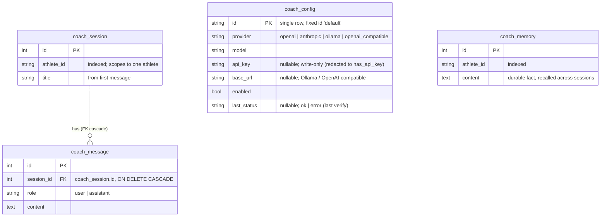

# FitMe - FitBuddy (AI Coach) Plugin

> Architecture, the separate `coach.db` data model, and a short implementation overview.

---

## 1. Overview

FitBuddy is an optional, self-contained AI coaching assistant: a chat drawer that
answers questions about *your* training data (activities, training load, zones,
goals, best efforts), grounded in the real numbers via tool calls rather than
guesswork. It is **plug-and-play**:

- **Optional dependency** - needs `pydantic-ai` (the `coach` extra); without it the
  app runs normally and the feature disappears.
- **Own database** - all state lives in a separate `coach.db`, so adding or removing
  it never touches the core schema or migrations.
- **One touch point** - mounted from a single guarded block in [main.py][backend-app-main-py]; nothing else in the core depends on it.
- **Bring your own model** - Ollama (local), OpenAI, or Anthropic, chosen at runtime in Settings.

---

## 2. Plugin Architecture

[main.py][backend-app-main-py] mounts the feature behind `try/except ImportError`,
so a missing dependency is a silent no-op. [register_coach][register-coach] imports
`pydantic_ai` (the gate), creates the coach tables, and includes the router - all
pydantic-ai imports are local, so absence fails fast and is skipped.

All backend code lives in `backend/app/coach/`:

| Module | Responsibility |
|--------|----------------|
| [`db.py`][db-py] | Separate engine, `CoachBase`, WAL pragmas, `create_tables()` |
| [`models.py`][models-py] | The four `coach.db` ORM models |
| [`provider.py`][provider-py] | Provider factory: stored config -> Pydantic AI model |
| [`agent.py`][agent-py] | The agent, system prompt, dynamic instructions |
| [`tools.py`][tools-py] | The "skill" tools the model can call |
| [`data_access.py`][data-access-py] | The **only** facade over core data |
| [`service.py`][service-py] | Chat streaming + plan generation |
| [`store.py`][store-py] | Session / message / memory CRUD |
| [`router.py`][router-py] | `/api/coach/*` REST + SSE endpoints |
| [`verify.py`][verify-py] | Connectivity check for the Verify button |

Tools read core data **only** through [data_access.py][data-access-py], so a core
repository or domain change is absorbed in one place.

---

## 3. The `coach.db` Data Model

A **separate SQLite database** ([db.py][db-py]) with its own engine and `CoachBase`
metadata, same pragmas as the core DB (WAL, `foreign_keys=ON`). Tables are created
with `create_all` on registration - **no Alembic**, since the whole feature drops
with the file. Defaults to `coach.db` beside `fitme.db`; override with
`FITME_COACH_DATABASE_URL`.

- `coach_config` mirrors the core `sync_config`: the key is write-only, and the last
  verification result is used to gate the UI.
- `coach_message -> coach_session` is the only DB-level FK (cascade);
  [delete_session][store-py] also deletes messages explicitly, so it never depends on
  the pragma.
- `coach_memory` has **no FK** to a session, so deleting a chat never erases learned
  facts. `athlete_id` ties sessions and memory to a core athlete logically - no
  cross-database FK is possible (the core lives in a different file).

---

## 4. Request Flow & Agent

`POST /api/coach/chat` streams the reply as **Server-Sent Events** (`session`,
`delta`, `done`, `error`; [router.py][router-py]). Generation runs in a **detached
background task** that persists both turns even if the browser disconnects - the SSE
response only tails it, so a reply is never lost and reopening the session shows it.

[service.py][service-py] replays history as **plain user/assistant text** (not
serialized tool calls), so a chat stays valid even when the provider or model is
switched between turns; the agent re-runs its tools against live data each turn.
[provider.py][provider-py] is the single place mapping config to a concrete model
(Anthropic/OpenAI need a key; Ollama / OpenAI-compatible use a base URL).

[agent.py][agent-py] is one Pydantic AI `Agent` with a coaching system prompt and
**dynamic instructions** injected per turn: the athlete's parameters, the page they
are viewing, and durable memory facts.

**Skill tools** ([tools.py][tools-py]) - seven read-only tools the model calls to
ground its answers, plus `remember`:

| Tool | Returns |
|------|---------|
| `get_recent_activities` | Recent activities (distance, duration, HR, power, pace) |
| `get_activity_details` | Full metrics for one activity |
| `get_training_load` | CTL / ATL / TSB, acute:chronic ratio, monotony, strain |
| `get_period_totals` | Volume per day/week/month/year |
| `get_athlete_profile` | Profile + HR / power / pace zones |
| `get_best_efforts` | Fastest times per distance |
| `get_goals` | Goals with progress |
| `remember` | Saves a durable fact to `coach_memory` |

**Memory** - `remember` persists lasting facts (goals, events, injuries,
preferences), de-duplicated; they are injected into later turns and are
viewable/forgettable in the UI, surviving chat deletion.

**Plans** - `POST /api/coach/plan` runs the same agent with
`output_type=[TrainingPlan, str]`: a typed week-by-week plan, or a clarifying message
when the model needs more (the union tolerates smaller local models that reply in
prose).

---

## 5. Configuration & Endpoints

A single config row, managed in Settings and mirroring the Intervals.icu sync config:

- **Write-only key** - responses return only `has_api_key`.
- **Verify on save** - saving (and the Verify button) makes a minimal model ping
  ([verify.py][verify-py]) with a generous timeout for cold-loading local models.
- **Usable gate** - `GET /api/coach/status` reports
  `usable = configured and enabled and last verify ok`; the launcher is hidden until
  then.

All endpoints under `/api/coach/` ([router.py][router-py]):

| Endpoint | Method | Purpose |
|----------|--------|---------|
| `/config` | GET/PUT/DELETE | Read, save (verifies first), or clear config |
| `/config/verify` | POST | Test settings without saving |
| `/status` | GET | Configured / enabled / usable gate |
| `/sessions`, `/sessions/{id}` | GET/POST/PATCH/DELETE | List, create, rename, delete chats |
| `/sessions/{id}/messages` | GET | Messages in a session |
| `/chat` | POST | Stream a reply (SSE) |
| `/memory`, `/memory/{id}` | GET/DELETE | List or forget durable facts |
| `/plan` | POST | Generate a training plan |
| `/data` | DELETE | Wipe all coach data |

---

## 6. Frontend

A **Chat panel** drawer, isolated under `frontend/components/coach/` and
`frontend/lib/coach/`:

- [CoachLauncher][coachlauncher], mounted once in [layout.tsx][frontend-app-layout-tsx],
  renders nothing until `status.usable` - zero coupling to feature pages.
- [CoachDrawer][coachdrawer] is the right slide-over: sessions, messages, a memory
  panel, and a plan card.
- [useCoachContext][usecoachcontext] derives the current view from the route alone
  (one-way coupling).
- [api.ts][frontend-lib-coach-api-ts] holds the SWR hooks and SSE client; responses
  are Zod-validated.

---

## 7. Enabling & Removing

**Enable:** `cd backend && uv sync --extra coach`, then pick a provider and model in
Settings and Verify.

**Remove** (fully isolated): delete `backend/app/coach/` and the frontend `coach/`
directories, drop the `register_coach` block in [main.py][backend-app-main-py] and
the `<CoachLauncher />` mount in [layout.tsx][frontend-app-layout-tsx], and delete
`coach.db`. The core schema and migrations are untouched.

<!-- Reference links -->
[agent-py]: backend/app/coach/agent.py
[backend-app-main-py]: backend/app/main.py
[coachdrawer]: frontend/components/coach/CoachDrawer.tsx
[coachlauncher]: frontend/components/coach/CoachLauncher.tsx
[data-access-py]: backend/app/coach/data_access.py
[db-py]: backend/app/coach/db.py
[frontend-app-layout-tsx]: frontend/app/layout.tsx
[frontend-lib-coach-api-ts]: frontend/lib/coach/api.ts
[models-py]: backend/app/coach/models.py
[provider-py]: backend/app/coach/provider.py
[register-coach]: backend/app/coach/__init__.py
[router-py]: backend/app/coach/router.py
[service-py]: backend/app/coach/service.py
[store-py]: backend/app/coach/store.py
[tools-py]: backend/app/coach/tools.py
[usecoachcontext]: frontend/lib/coach/context.ts
[verify-py]: backend/app/coach/verify.py
