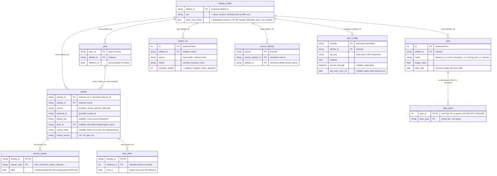
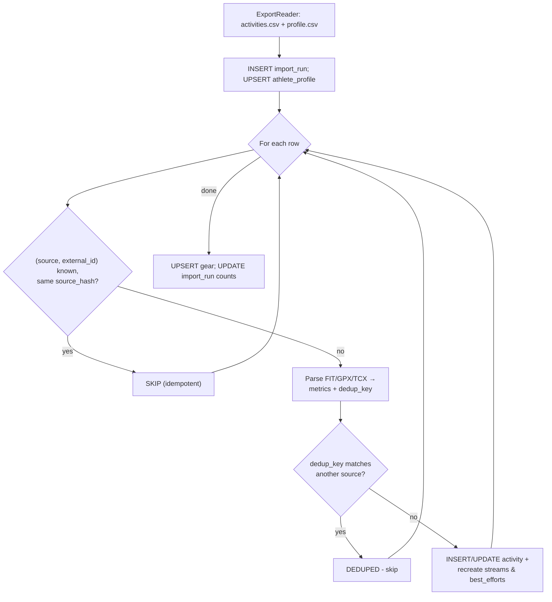
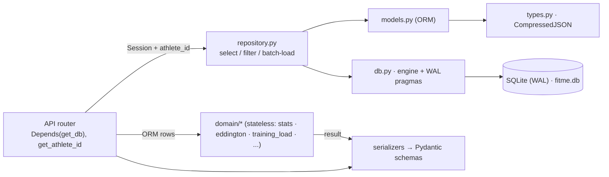
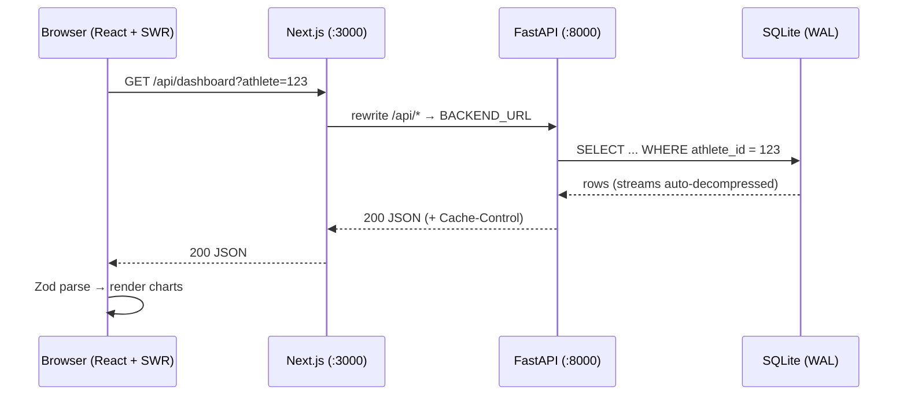

# FitMe - Database Insights

> How the database is structured, how it stores data, and how the backend and
> (indirectly) the frontend talk to it.

---

## 1. Overview

FitMe uses a single **SQLite** file as its only data store - a self-hosted,
single-athlete deployment with no external server, pool tuning, or multi-tenancy.

| Property | Value |
|----------|-------|
| **Engine** | SQLite 3, WAL journal mode, `synchronous=NORMAL` |
| **Concurrency** | `busy_timeout=5000` (readers wait for the single writer) |
| **Foreign keys** | `ON` per connection - enforces the one declared FK (`goal_sport`) |
| **Location** | `backend/storage/fitme.db` (+ `-wal`, `-shm` sidecars) |
| **ORM / migrations** | SQLAlchemy 2.0 (declarative `Mapped[...]`) / Alembic |

The URL is set by `FITME_DATABASE_URL` (see [config.py][backend-app-config-py]) and
defaults under `backend/storage/`. The schema is SQLite-first but the ORM and
repository contain no raw SQLite-only SQL except one `strftime` year query.

> The optional **FitBuddy** AI coach keeps its state in a **separate `coach.db`** with
> its own engine and metadata, so it never touches the schema here. See
> [doc/coach.md][doc-coach-md].

---

## 2. Entity-Relationship Diagram

Ten tables, all logically scoped to a single `athlete_id`.

> **Relationships are application-enforced.** The models declare **no SQL foreign
> keys** except `goal_sport` - columns like `activity.athlete_id` or
> `activity_stream.activity_id` are plain indexed strings, joined explicitly in
> [repository.py][backend-app-repository-py] and cascaded in Python (see
> [athletes.py][backend-app-api-athletes-py]). The `PK`/`FK` markers below describe
> *intent*. The one real SQL FK is `goal_sport.goal_id -> goal` (`ON DELETE CASCADE`),
> which SQLite enforces because `foreign_keys=ON` is set per connection.



> The metric columns on `activity` (distance, time, elevation, HR, power, pace,
> polyline, ...) are stored in SI base units and omitted above for brevity; §3 covers
> the important ones.

---

## 3. Tables in Detail

### 3.1 `activity` - the hub entity

The central record for one workout, in **SI base units** plus a compact encoded
`polyline`. Defined in [models.py][backend-app-models-py-l11]. `user_note` (UI-written
free text) is separate from the imported `description`, so re-imports never overwrite
user content.

**Identity is source-aware.** An activity is unique on `(athlete_id, source,
external_id)` (a `UNIQUE` index). `activity_id` equals `external_id` for Strava
(backward compatibility) and `provider:external_id` otherwise. A `dedup_key`
fingerprint lets the importer recognise the same workout from two providers without
duplicating it.

> Don't confuse `source` (the **provider**: strava/garmin) with `import_source` (the
> **file type**: csv/fit/gpx/tcx).

Indexes are tuned for the dashboard's filtered queries: single-column indexes on the
filterable fields, composites such as `(athlete_id, start_date_time)` for the default
list, `(sport_type, start_date_time)` and `(activity_type, start_date_time)` for
filtered views, and `(athlete_id, dedup_key)` for cross-source lookup.

### 3.2 `activity_stream` - time-series data

One row per `(activity_id, stream_type)`. `data` holds the full sample array as a
**zlib-compressed JSON BLOB** via the `CompressedJSON` type (see §4). Streams are
capped at `MAX_STREAM_SAMPLES = 2000` points during import. Types (`StreamType` in
[enums.py][backend-app-enums-py]): `time`, `distance`, `latlng`, `altitude`,
`velocity_smooth`, `heartrate`, `cadence`, `watts`.

### 3.3 `best_effort` - fastest times per distance

Pre-computed fastest time over standard distance buckets within an activity. Composite
PK `(activity_id, distance_m)`; a composite `ix_best_effort_lookup` makes "PR over
distance X" lookups index-only.

### 3.4 `gear` - bikes and shoes

PK `gear_id`. Accumulates `distance_m`. Activities reference gear through the
**denormalized** `activity.gear_id` + `activity.gear_name`.

### 3.5 `import_run` - import audit trail

One row per import, written at start (`running`) and updated on completion with counts
and a final `status`. Powers the import summary in the UI.

### 3.6 `athlete_profile` - identity + training config

PK `athlete_id`, parsed from `profile.csv` - the closest thing to a "users" table.
Training parameters (FTP, max/resting HR, weight, birthday, zone boundaries, units)
are nullable columns here; DB values take precedence over model defaults.

### 3.7 `goal` + `goal_sport` - training goals

Auto-increment PK. Tracks a target over a flexible date range; `metric` is one of
`distance_m`, `count`, `elevation_m`, `moving_time_s`, `calories`. Progress is computed
at query time by aggregating `activity` over the range - no denormalized counters. The
sports a goal counts toward live in the `goal_sport` join table (empty = all sports),
so one goal can target several at once.

`goal_sport` is the **only table with a database-level foreign key**: `goal_id ->
goal.id` with `ON DELETE CASCADE`, enforced by SQLite because `foreign_keys=ON` is set
per connection. The goals API also models it as an ORM relationship
(`cascade="all, delete-orphan"`, [models.py][backend-app-models-py]).

### 3.8 `sync_config` - continuous provider sync

PK `provider` (currently `intervals`). One row stores credentials, the canonical
`athlete_id` for synced activities, and watermark/status fields. `api_key` is
write-only in API responses.

### 3.9 `source_identity` - cross-source athlete mapping

Composite PK `(source, source_athlete_id)`. Maps each provider's athlete ID to the
canonical `athlete_id` chosen on first import, so later imports from the same account
resolve automatically.

---

## 4. The `CompressedJSON` type

Activity streams are large numeric arrays that compress well. A custom SQLAlchemy
`TypeDecorator` ([types.py][backend-app-types-py]), backed by a `LargeBinary` column,
transparently compresses on write and decompresses on read:

```
Write: Python list → json.dumps (compact separators) → zlib.compress → BLOB
Read:  BLOB → zlib.decompress → json.loads → Python list
```

A legacy `str` value (pre-compression) is still parsed as plain JSON on read, and
`cache_ok = True` lets SQLAlchemy cache statements using the type. Net storage is
~70-80% smaller than raw JSON.

---

## 5. Write path - the import pipeline

Bulk writes originate from the **importer**
([importer.py][backend-app-ingestion-importer-py]); user-authored data (notes, goals,
config, sync settings) is written through dedicated REST endpoints. The importer is
**idempotent** and **source-aware**, resolving each row in two tiers:

1. **Same provider** - `(source, external_id)` identifies the row; an unchanged
   `source_hash` skips it, a changed one updates it.
2. **Across providers** - a new id whose `dedup_key` matches an activity from a
   *different* source is the same workout, so it is skipped (counted as `deduped`).



- **Idempotency** - unchanged rows are skipped with no writes; to re-apply parser
  changes, `make db-reset` or pass `--force`.
- **Cross-source dedup** - the `dedup_key` ([dedup.py][backend-app-domain-dedup-py]) is
  derived from immutable, bucketed properties (sport, start minute, distance, moving
  time), so the same ride from Strava and Garmin collapses to one row. Same-source rows
  fall back to id matching and are never falsely deduped.
- **Background, single-writer** - uploads run on a `ThreadPoolExecutor` thread (the
  client polls `import_run`); SQLite allows one writer while WAL keeps reads
  non-blocking.

---

## 6. Backend ↔ database

The backend is layered so that **only one layer touches the session**, keeping the
business logic DB-free and unit-testable.



- **`db.py`** ([db.py][backend-app-db-py]) owns the engine (`check_same_thread=False`
  for SQLite), the per-connection pragmas (`WAL`, `synchronous=NORMAL`,
  `busy_timeout=5000`, `foreign_keys=ON`), `SessionLocal`, the `get_db()` dependency,
  and `init_db()` (dev `create_all`).
- **`repository.py`** ([repository.py][backend-app-repository-py]) is pure functions
  taking `(Session, athlete_id)` - the only place (besides the importer and athlete
  admin) that builds queries. Filters are pushed into SQL `WHERE` clauses, streams are
  batch-loaded (no N+1), and aggregates use `func.count/min/max`.
- **Athlete resolution** ([athletes.py][backend-app-api-athletes-py]) - `get_athlete_id`
  reads `?athlete=`, falling back to the most recently updated profile if the id is
  unknown (e.g. after a `db-reset`); `get_required_athlete_id` is the strict 404 variant.
- **Flow** - a router fetches ORM rows via `repository.*`, hands them to a stateless
  `domain/*` function, then serializes through Pydantic
  ([schemas.py][backend-app-schemas-py]). `CacheControlMiddleware`
  ([main.py][backend-app-main-py]) adds `Cache-Control` to stable reads.

---

## 7. Frontend ↔ database

The frontend **never** touches SQLite. The browser talks only to the Next.js origin,
which proxies to FastAPI, the sole owner of the database.



- **Single origin** - [next.config.mjs][frontend-next-config-mjs] rewrites `/api/*` to
  `BACKEND_URL`, avoiding CORS.
- **Typed fetching** - [api.ts][frontend-lib-api-ts] exposes SWR hooks whose fetchers
  Zod-validate every response - a second boundary on top of backend Pydantic.
- Mutations (imports, notes, goals, config, sync) go through the REST API; the frontend
  never touches SQLite directly.

---

## 8. Migrations & schema lifecycle

Schema is managed by **Alembic** ([backend/alembic/][backend-alembic]). The environment
([env.py][backend-alembic-env-py]) sets the URL from settings and enables
`render_as_batch=True`, required because SQLite cannot `ALTER`/`DROP` columns in place.

The earlier incremental migrations have been **squashed into a single
`baseline_schema.py`** that creates the full current schema (all ten tables) in one
step; `down_revision` is `None`. Since the project ships no released database predating
the squash, no intermediate revisions are kept.

| Context | Mechanism |
|---------|-----------|
| **Docker** | `alembic upgrade head` before `uvicorn` (CMD in [Dockerfile][backend-dockerfile]) |
| **Local dev** | `make migrate` → `uv run alembic upgrade head` |
| **Dev convenience** | `auto_create_tables=True` calls `init_db()` on startup |

> `create_all` only creates *missing* tables and never alters existing ones, so it is
> safe alongside Alembic in dev; Alembic stays the source of truth for production.

---

## 9. Configuration & commands

Settings from [config.py][backend-app-config-py] (all overridable via `FITME_`-prefixed
env vars): `FITME_DATABASE_URL` (default `sqlite:///backend/storage/fitme.db`),
`FITME_STORAGE_DIR`, `FITME_AUTO_CREATE_TABLES`. In Docker the URL points at
`/app/storage/fitme.db` on a bind mount so the DB survives restarts (see
[docker-compose.yml][docker-compose-yml]).

Common commands ([Makefile][makefile]): `make migrate` (apply migrations), `make seed`
(migrate + generate + import sample data), `make import SOURCE=...`, `make db-reset`
(delete the DB + uploads).

> After changing import/parsing logic, run `make db-reset` before re-importing -
> otherwise `source_hash` skips unchanged rows and your changes won't apply (or pass
> `--force`).

---

## 10. Summary

- **One SQLite file** in WAL mode, ten tables, scoped per athlete.
- **Almost no DB-level foreign keys** - relationships and cascades live in application
  code; the lone exception is `goal_sport -> goal` (`ON DELETE CASCADE`).
- **Source-aware identity** - activities are unique per `(athlete_id, source,
  external_id)`, with a `dedup_key` skipping the same workout from another provider.
- **User-authored data** (`user_note`, goals) survives re-imports; training params live
  on `athlete_profile`.
- **Streams are zlib-compressed** via `CompressedJSON`.
- **Layered access** - `db.py` owns the session, `repository.py` the queries, `domain/*`
  is stateless, and Alembic manages the schema.

<!-- Reference links -->
[backend-alembic]: backend/alembic/
[backend-alembic-env-py]: backend/alembic/env.py
[backend-app-api-athletes-py]: backend/app/api/athletes.py
[backend-app-config-py]: backend/app/config.py
[backend-app-db-py]: backend/app/db.py
[backend-app-domain-dedup-py]: backend/app/domain/dedup.py
[backend-app-enums-py]: backend/app/enums.py
[backend-app-ingestion-importer-py]: backend/app/ingestion/importer.py
[backend-app-main-py]: backend/app/main.py
[backend-app-models-py]: backend/app/models.py
[backend-app-models-py-l11]: backend/app/models.py#L11
[backend-app-repository-py]: backend/app/repository.py
[backend-app-schemas-py]: backend/app/schemas.py
[backend-app-types-py]: backend/app/types.py
[backend-dockerfile]: backend/Dockerfile
[doc-coach-md]: doc/coach.md
[docker-compose-yml]: docker-compose.yml
[frontend-lib-api-ts]: frontend/lib/api.ts
[frontend-next-config-mjs]: frontend/next.config.mjs
[makefile]: Makefile
