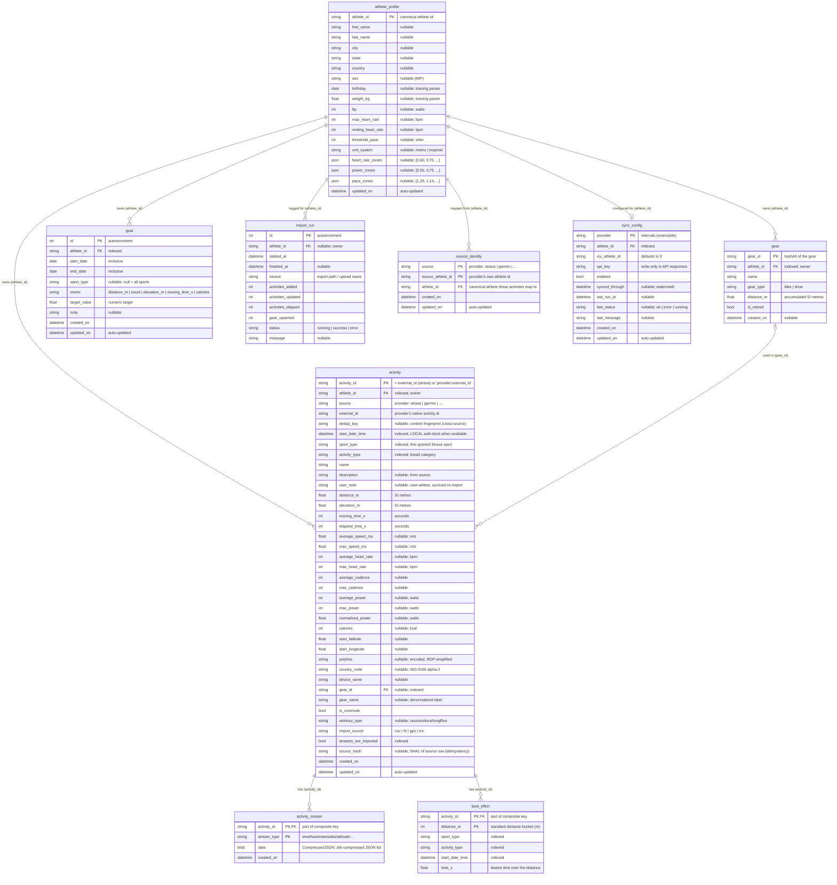
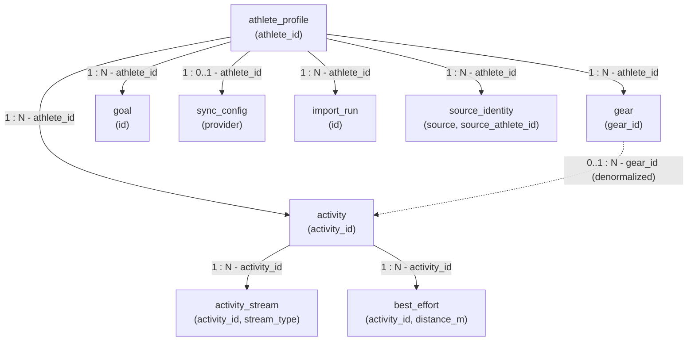
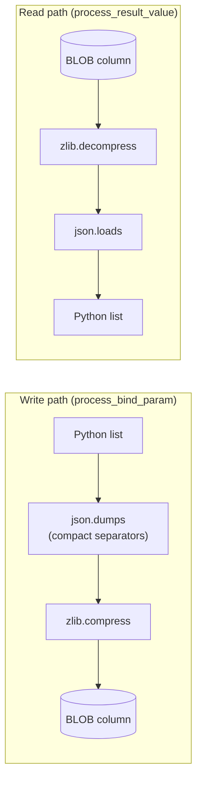
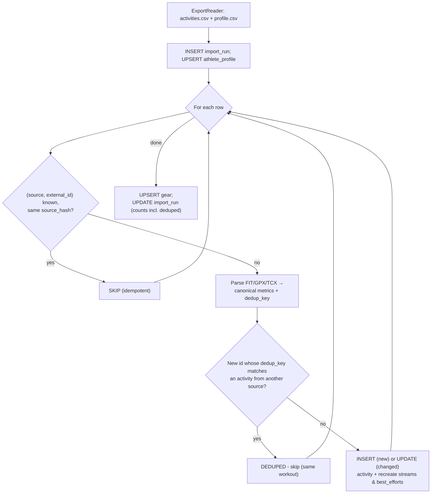
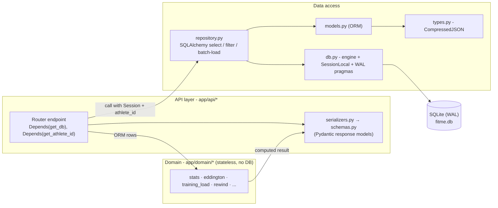
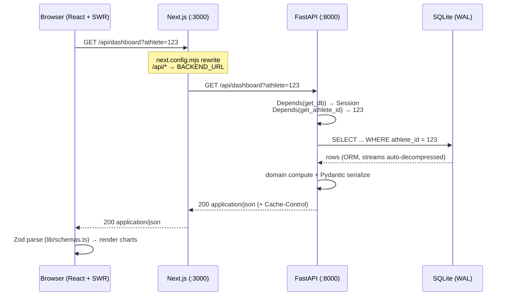
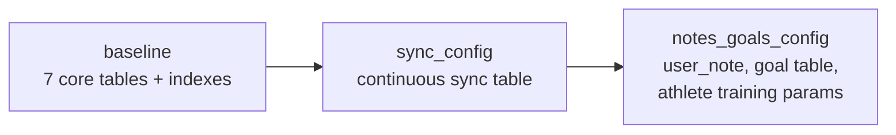

# FitMe - Database Insights

> How the database is structured, how it stores data, and how it communicates
> with the backend and (indirectly) the frontend.

---

## 1. Overview

FitMe uses a single **SQLite** database file as its only data store. It is
designed for a self-hosted, single-athlete deployment, so there is no external
database server, connection pool tuning, or multi-tenant isolation to manage.

| Property | Value |
|----------|-------|
| **Engine** | SQLite 3 |
| **Journal mode** | WAL (Write-Ahead Logging) - concurrent reads during writes |
| **Synchronous** | `NORMAL` - good durability/speed trade-off under WAL |
| **File location** | `backend/storage/fitme.db` (`+ -wal`, `-shm` sidecar files) |
| **ORM** | SQLAlchemy 2.0 (declarative `Mapped[...]` models) |
| **Migrations** | Alembic |
| **Access pattern** | One file, single writer, application-enforced relationships |

The database URL is configurable through the `FITME_DATABASE_URL` environment
variable (see [backend/app/config.py](backend/app/config.py)). It defaults to a
file under `backend/storage/`. Although the schema is SQLite-first, the ORM and
repository layers contain no raw SQLite-only SQL except a single `strftime`
year query.

---

## 2. Entity-Relationship Diagram

The schema has **nine tables**, all logically scoped to a single `athlete_id`.

> **Important:** The relationships below are *application-enforced* (logical).
> The ORM models declare **no SQL `FOREIGN KEY` constraints** - columns such as
> `activity.athlete_id`, `activity_stream.activity_id`, and `activity.gear_id`
> are plain indexed string columns. Joins are performed explicitly in
> [backend/app/repository.py](backend/app/repository.py), and cascade deletes
> are handled in Python (see [backend/app/api/athletes.py](backend/app/api/athletes.py)).
> The `PK`/`FK` markers in the diagram describe *intent*, not database-level
> constraints.

---

## 3. Tables in Detail

### 3.1 `activity` - the hub entity

The central record for one recorded workout. Stores summary metrics in **SI base
units** (metres, metres/second, seconds) and a compact encoded `polyline` for map
rendering. Defined in [backend/app/models.py](backend/app/models.py#L11).

The `user_note` column holds free-text notes written by the user in the UI. It is
separate from the imported `description` field, so re-imports never overwrite
user-authored content.

**Identity is source-aware.** An activity is uniquely identified by
`(athlete_id, source, external_id)` - the provider it came from plus that
provider's native id - enforced by a `UNIQUE` index. The `activity_id` primary
key equals `external_id` for Strava (backward compatibility) and
`provider:external_id` for any other source. A `dedup_key` content fingerprint
lets the importer recognise the same workout exported from two providers without
duplicating it (see [§6](#6-write-path---the-import-pipeline)).

> Don't confuse `source` (the **provider**: strava/garmin) with `import_source`
> (the **file type** the streams came from: csv/fit/gpx/tcx).

**Indexes** (single + composite, tuned for the dashboard's filtered queries):

| Index | Columns | Used by |
|-------|---------|---------|
| `ix_activity_athlete_id` | `athlete_id` | every athlete-scoped query |
| `ix_activity_start_date_time` | `start_date_time` | time ordering / ranges |
| `ix_activity_sport_type` | `sport_type` | sport filter |
| `ix_activity_activity_type` | `activity_type` | category filter |
| `ix_activity_gear_id` | `gear_id` | gear roll-ups |
| `ix_activity_streams_are_imported` | `streams_are_imported` | stream backfill checks |
| `ix_activity_athlete_start` | `(athlete_id, start_date_time)` | dashboard/list default |
| `ix_activity_sport_start` | `(sport_type, start_date_time)` | sport + time |
| `ix_activity_type_start` | `(activity_type, start_date_time)` | category + time |
| `ix_activity_athlete_dedup` | `(athlete_id, dedup_key)` | cross-source dedup lookup |
| `uq_activity_source_external` | `(athlete_id, source, external_id)` **UNIQUE** | one row per provider id |

### 3.2 `activity_stream` - time-series data

One row per `(activity_id, stream_type)` pair. The `data` column holds the full
sample array (e.g. every heart-rate reading) as a **zlib-compressed JSON BLOB**
via the custom `CompressedJSON` type (see [§5](#5-the-compressedjson-custom-type)).
Streams are capped at `MAX_STREAM_SAMPLES = 2000` points during import to bound
storage and render cost.

Persisted stream types (see `StreamType` in [backend/app/enums.py](backend/app/enums.py)):
`time`, `distance`, `latlng`, `altitude`, `velocity_smooth`, `heartrate`, `cadence`, `watts`.

### 3.3 `best_effort` - fastest times per distance

Pre-computed fastest time over standard distance buckets (e.g. 400 m, 1 km, 5 km)
within an activity. Composite PK `(activity_id, distance_m)`. A composite
`ix_best_effort_lookup` on `(activity_type, distance_m, time_s)` makes
"personal record over distance X" lookups index-only.

### 3.4 `gear` - bikes and shoes

PK `gear_id`. Accumulates total `distance_m` across activities. `gear_type` is a
free string (`bike` | `shoe`). Activities reference gear through the
**denormalized** `activity.gear_id` + `activity.gear_name` columns.

### 3.5 `import_run` - import audit trail

One row per import invocation, written at the start (`status = "running"`) and
updated on completion with counts (`added`/`updated`/`skipped`/`gear_upserted`)
and a final `status`. Powers the import summary in the UI.

### 3.6 `athlete_profile` - athlete identity + training config

PK `athlete_id`. Parsed from the export's `profile.csv`. This is the closest
thing to a "users" table; the active athlete is resolved from the `?athlete=`
query parameter, falling back to the most recently updated profile (see
[§7.3](#73-athlete-resolution)).

Training parameters (FTP, max/resting HR, weight, birthday, zone boundaries,
unit system) are stored directly on this table as nullable columns. DB values
take precedence over hardcoded model defaults for any field left null.

### 3.7 `goal` - training goals

Auto-increment PK. Tracks targets over flexible date ranges (e.g. "run 200 km
in June 2026"). `sport_type` is nullable - null means all sports count.
`metric` is one of `distance_m`, `count`, `elevation_m`, `moving_time_s`, or
`calories`.

Progress is computed at query time by aggregating from the `activity` table
(`WHERE start_date_time BETWEEN goal.start_date AND goal.end_date`), optionally
filtered by `sport_type`. No denormalized counters to keep in sync.

Composite index on `(athlete_id, start_date, end_date)` for date-range lookups.

### 3.8 `sync_config` - continuous provider sync

PK `provider` (currently only `intervals` for Intervals.icu). One row per sync
provider stores credentials, the canonical `athlete_id` for landing synced
activities, and watermark/status fields for incremental pulls. The `api_key`
is write-only in API responses.

### 3.9 `source_identity` - cross-source athlete mapping

Composite PK `(source, source_athlete_id)`. When the same person exports from
both Strava and Garmin, their provider-specific athlete IDs differ. On first
import the user chooses which canonical `athlete_id` to merge into; that
decision is stored here so subsequent imports from the same provider account
resolve automatically.

---

## 4. Relationships (application-enforced, no SQL foreign keys)

No DB-level foreign keys - integrity is maintained in code:

- **Ownership scoping** - Every read goes through a repository helper that adds
  `WHERE athlete_id = :athlete_id`. Cross-athlete access is impossible because
  the filter is always present.
- **Joins** - `best_effort` → `activity` joins are written explicitly in the
  repository (e.g. `select(BestEffort).join(Activity, BestEffort.activity_id == Activity.activity_id)`).
- **Cascade delete** - Deleting an athlete deletes their activities, streams,
  best efforts, gear and import runs in a single Python routine in
  [backend/app/api/athletes.py](backend/app/api/athletes.py); the database does
  not cascade automatically.
- **Re-import cleanup** - When an activity changes, its streams and best efforts
  are `DELETE`d and recreated (see [§6](#6-write-path---the-import-pipeline)).

---

## 5. The `CompressedJSON` custom type

Activity streams are large numeric arrays that compress extremely well. Rather
than store raw JSON, FitMe uses a custom SQLAlchemy `TypeDecorator` defined in
[backend/app/types.py](backend/app/types.py) that transparently compresses on the
way in and decompresses on the way out. It is backed by a `LargeBinary` (BLOB)
column.

- **Compact encoding** - `json.dumps(value, separators=(",", ":"))` removes
  whitespace before compression.
- **Backward compatibility** - On read, a legacy `str` value (from before the
  compression migration) is parsed as plain JSON, so old rows still load.
- **`cache_ok = True`** - lets SQLAlchemy cache statements that use the type.

This reduces stream storage by roughly 70–80% versus raw JSON.

---

## 6. Write path - the import pipeline

Bulk data writes originate from the **importer**
([backend/app/ingestion/importer.py](backend/app/ingestion/importer.py)).
User-authored data (activity notes, goals, athlete config, sync settings) is
written through dedicated REST endpoints. The importer is **idempotent** and
**source-aware**, resolving each row in two tiers:

1. **Same provider** - `(source, external_id)` identifies the row. An unchanged
   `source_hash` skips it; a changed one updates it.
2. **Across providers** - a new id whose `dedup_key` fingerprint matches an
   activity already imported from a *different* source is the same workout, so it
   is skipped (counted as `deduped`) instead of duplicated.

Key points:

- **Idempotency** - Unchanged rows (same `source_hash`) are skipped with no DB
  writes. To re-apply parser changes you must wipe the DB (`make db-reset`) or
  pass `--force`.
- **Cross-source de-duplication** - The `dedup_key`
  ([backend/app/domain/dedup.py](backend/app/domain/dedup.py)) is derived from
  immutable properties - sport plus start minute, distance and moving time,
  each bucketed to absorb rounding - so the same ride from Strava and Garmin
  collapses to one row. Same-source rows are never falsely deduped; they fall
  back to id matching.
- **Background execution** - Uploads run the import on a `ThreadPoolExecutor`
  thread so the HTTP request returns immediately; the client polls `import_run`
  state for completion.
- **Single writer** - SQLite allows one writer at a time; WAL mode keeps reads
  non-blocking while the import writes.

---

## 7. How the backend communicates with the database

The backend is organized in clear layers so that **only one layer touches the
database session**, and the business logic stays DB-free and unit-testable.

### 7.1 Connection & session management - `db.py`

[backend/app/db.py](backend/app/db.py) owns everything stateful:

- **`engine`** - created from `settings.database_url`. For SQLite it passes
  `check_same_thread=False` so the connection can be shared across FastAPI's
  threadpool.
- **WAL pragmas** - a `connect` event listener runs `PRAGMA journal_mode=WAL`
  and `PRAGMA synchronous=NORMAL` on every new connection.
- **`SessionLocal`** - a `sessionmaker` with `autoflush=False`, `autocommit=False`.
- **`get_db()`** - a FastAPI dependency that yields a session and always closes
  it in a `finally` block.
- **`Base`** - the declarative base all models inherit from.
- **`init_db()`** - dev convenience that runs `Base.metadata.create_all`.

### 7.2 Data access layer - `repository.py`

[backend/app/repository.py](backend/app/repository.py) is a collection of
**pure functions** that take a `Session` plus an `athlete_id` and return ORM
objects. It is the *only* module (besides the importer and the athlete-admin
endpoints) that builds queries. Notable patterns:

- **SQL-level filtering** - sport/type/date/distance/search filters are pushed
  into `WHERE` clauses (`_apply_filters`) instead of filtering in Python.
- **Batch loading (no N+1)** - `streams_for_activities(...)` loads streams for
  many activities in a single `IN (...)` query for the dashboard.
- **Lightweight aggregates** - `distinct_years`, `date_range`,
  `distinct_sport_types`, and `count_activities` use `func.count` / `func.min`
  / `func.max` so the database does the work.

### 7.3 Athlete resolution

[backend/app/api/athletes.py](backend/app/api/athletes.py) provides the
`get_athlete_id` dependency used by every feature endpoint. It reads the
`?athlete=` query parameter; if that id is unknown (e.g. a stale id cached in the
browser after a `db-reset`), it **falls back to the most recently updated
profile** so the UI can recover instead of 404-ing everywhere.
`get_required_athlete_id` is the strict variant that raises `404` when no
athlete exists at all.

### 7.4 Request → response flow

1. A router endpoint declares `db: Session = Depends(get_db)` and
   `athlete_id: str = Depends(get_athlete_id)`.
2. It calls one or more `repository.*` functions to fetch ORM rows.
3. It hands those rows to a **stateless `domain/*`** function for computation
   (the domain layer never imports the session).
4. It serializes the result through `serializers.py` into a **Pydantic** schema
   from [backend/app/schemas.py](backend/app/schemas.py), which FastAPI returns
   as JSON.
5. `CacheControlMiddleware` ([backend/app/main.py](backend/app/main.py)) adds
   `Cache-Control: public, max-age=300` to stable read endpoints.

---

## 8. How the frontend communicates with the database

The frontend **never** talks to SQLite directly. The browser only ever talks to
the Next.js origin, which proxies API calls to FastAPI, which is the sole owner
of the database.

- **Single origin / rewrites** - [frontend/next.config.mjs](frontend/next.config.mjs)
  rewrites `/api/:path*` to `${BACKEND_URL}/api/:path*` (`http://backend:8000`
  in Docker, `http://localhost:8000` in dev). This avoids CORS in the browser.
- **Typed fetching** - [frontend/lib/api.ts](frontend/lib/api.ts) exposes SWR
  hooks (`useDashboard`, `useMeta`, …) whose fetchers validate every response
  through **Zod** schemas before the data reaches a component. This is a second
  validation boundary on top of the backend's Pydantic models.
- **Reads and targeted writes** - Most requests are `GET`s. The frontend also
  issues `POST`/`PUT`/`DELETE` for imports, activity notes, goals, athlete
  config, and sync configuration. All mutations go through the REST API; the
  frontend never touches SQLite directly.

---

## 9. Migrations & schema lifecycle

Schema is managed by **Alembic** ([backend/alembic/](backend/alembic/)). The
migration environment ([backend/alembic/env.py](backend/alembic/env.py)) sets the
URL from `settings.database_url` and enables `render_as_batch=True`, which is
required because SQLite cannot `ALTER`/`DROP` columns in place (Alembic emulates
it via table copy).

**Revision history:**

- **`baseline`** - creates the original seven tables in one step.
- **`sync_config`** - adds the `sync_config` table for Intervals.icu sync.
- **`notes_goals_config`** - adds `user_note` column to `activity`, creates the
  `goal` table, and extends `athlete_profile` with training parameter columns.

> Generate new migrations with
> `uv run alembic revision --autogenerate -m "describe change""`.

**When migrations run:**

| Context | Mechanism |
|---------|-----------|
| **Docker** | `alembic upgrade head` runs before `uvicorn` (CMD in [backend/Dockerfile](backend/Dockerfile)) |
| **Local dev** | `make migrate` → `uv run alembic upgrade head` |
| **Dev convenience** | `auto_create_tables=True` calls `init_db()` (`create_all`) on app startup ([backend/app/main.py](backend/app/main.py)) - Alembic remains the source of truth for production |

> Alembic and `create_all` coexist: `create_all` only creates *missing* tables
> and never alters existing ones, so it is safe alongside migrations in dev.

---

## 10. Configuration & operational commands

### 10.1 Relevant settings

From [backend/app/config.py](backend/app/config.py) (all overridable via
`FITME_`-prefixed environment variables):

| Setting | Env var | Default |
|---------|---------|---------|
| Database URL | `FITME_DATABASE_URL` | `sqlite:///backend/storage/fitme.db` |
| Storage dir | `FITME_STORAGE_DIR` | `backend/storage` |
| Auto-create tables | `FITME_AUTO_CREATE_TABLES` | `true` |

In Docker the URL is set to `sqlite:////app/storage/fitme.db` and the
`backend/storage` directory is bind-mounted so the database survives container
restarts (see [docker-compose.yml](docker-compose.yml)).

### 10.2 Common database commands ([Makefile](Makefile))

| Command | Effect |
|---------|--------|
| `make migrate` | Apply migrations (creates the SQLite file) |
| `make seed` | Migrate + generate sample data + import it |
| `make import SOURCE=/path/export.zip` | Import a Strava export via the CLI |
| `make db-reset` | Delete `fitme.db` (+ `-wal`/`-shm`) and uploaded exports |

> After changing import/parsing logic, run `make db-reset` before re-importing -
> otherwise `source_hash` causes unchanged rows to be **skipped** and your
> changes won't be applied (or pass `--force`).

---

## 11. Summary

- **One SQLite file** in WAL mode, nine tables, scoped per athlete.
- **No DB-level foreign keys** - relationships and cascades are enforced in
  application code (repository joins + Python cascade delete).
- **Source-aware identity** - activities are unique per
  `(athlete_id, source, external_id)`, and a `dedup_key` fingerprint skips the
  same workout imported from a different provider. `source_identity` maps
  provider athlete IDs to the canonical `athlete_id`.
- **User-authored data** - activity notes (`user_note`) and training goals
  (`goal` table) are written from the UI and survive re-imports.
- **DB-first config** - training parameters live on `athlete_profile` with
  YAML fallback for unset fields.
- **Streams are compressed** transparently via the `CompressedJSON` type.
- **Layered access** - `db.py` owns the session, `repository.py` owns the
  queries, `domain/*` is stateless, and the API serializes through Pydantic.
- **Alembic** manages the schema; migrations run automatically in Docker and via
  `make migrate` locally.
